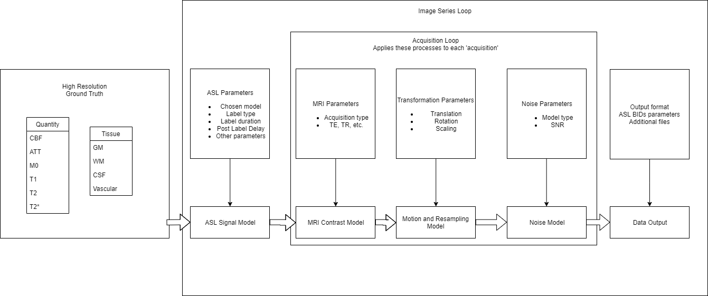

# Overview

ASL DRO is software that can generate digital reference objects for Arterial Spin Labelling (ASL) MRI.
It creates synthetic raw ASL data according to set acquisition and data format parameters, based
on input ground truth maps for:


* Perfusion rate


* Transit time


* Intrinsic MRI parameters: M0, T1, T2, T2\*


* Tissue segmentation (defined as a single tissue type per voxel)

Synthetic data is generated in Brain Imaging Data Structure format, comprising of a NIFTI image file
and accompanying json sidecar containing parameters.

ASLDRO was developed to address the need to test ASL image processing pipelines with data that has
a known ground truth. A strong emphasis has been placed on ensuring traceability of the developed
code, in particular with respect to testing.  The DRO pipelines uses a ‘pipe and filter’ architecture
with ‘filters’ performing data processing, which provides a common interface between processing
blocks.

# Installation

ASLDRO can be installed as a module directly from the python package index.  Once installed it can
simply be run as a command-line tool.  For more information how to use a python package in this
way please see [https://docs.python.org/3/installing/index.html](https://docs.python.org/3/installing/index.html)

## Python Version

We recommend using the latest version of Python. ASL DRO supports Python
3.7 and newer.

## Dependencies

These distributions will be installed automatically when installing ASL DRO.


* [nibabel](https://nipy.org/nibabel/) provides read / write access to some common neuroimaging file formats


* [numpy](https://numpy.org/) provides efficient calculations with arrays and matrices


* [jsonschema](https://python-jsonschema.readthedocs.io/en/stable/) provides an implementation of JSON Schema validation for Python


* [nilearn](https://nipy.org/packages/nilearn/index.html) provides image manipulation tools and statistical learning for neuroimaging data

## Virtual environments

Use a virtual environment to manage the dependencies for your project, both in
development and in production.

What problem does a virtual environment solve? The more Python projects you
have, the more likely it is that you need to work with different versions of
Python libraries, or even Python itself. Newer versions of libraries for one
project can break compatibility in another project.

Virtual environments are independent groups of Python libraries, one for each
project. Packages installed for one project will not affect other projects or
the operating system’s packages.

Python comes bundled with the `venv` module to create virtual
environments.

### Create an environment

Create a project folder and a `venv` folder within:

```
$ mkdir myproject
$ cd myproject
$ python3 -m venv venv
```

On Windows:

```
$ py -3 -m venv venv
```

### Activate the environment

Before you work on your project, activate the corresponding environment:

```
$ . venv/bin/activate
```

On Windows:

```
> venv\Scripts\activate
```

Your shell prompt will change to show the name of the activated
environment.

## Install ASL DRO

Within the activated environment, use the following command to install
ASL DRO:

```
$ pip install asldro
```

ASL DRO is now installed. Check out the Quickstart or go to the
Documentation Overview.

# Quickstart

## Getting started

Eager to get started? This page gives a good introduction to ASL DRO.
Follow Installation to set up a project and install ASL DRO first.

After installation the command line tool `asldro` will be made available. You can run:

```
asldro generate path/to/output_file.zip
```

to run the DRO generation as-per the ASL White Paper specification. The output file may
be either .zip or .tar.gz.

Is it also possible to specify a parameter file, which will override any of the default values:

```
asldro generate --params path/to/input_params.json path/to/output_file.zip
```

It is possible to create an example parameters file containing the model defaults by running:

```
asldro output params /path/to/input_params.json
```

which will create the `/path/to/input_params.json` file. The parameters may be adjusted as
necessary and used with the ‘generate’ command.

For details on input parameters see Parameters

It is also possible to output the high-resolution ground-truth (HRGT) files.
To get a list of the available data, type:

```
asldro output hrgt -h
```

To output the HRGT, type:

```
asldro output hrgt HRGT OUTPUT_DIR
```

where HRGT is the code of the files to download, and OUTPUT_DIR is the directory to output to.

## Pipeline details

There are three pipelines available in ASLDRO


* The full ASL pipeline.


* A structural MRI pipeline (generates gradient echo, spin echo or inversion recovery signal).


* A ground truth pipeline that simply resamples the input ground truth to the specified resolution.

In a single instance of ASLDRO, the input parameter file can configure any number and configurations
of these pipelines to be run, much in the way that this can be done on an MRI scanner.

The full ASL pipeline comprises of:


1. Loading in the ground truth volumes.


2. Producing $\Delta M$ using the General Kinetic Model for the specified ASL parameters.


3. Generating synthetic M0, Control and Label volumes.


4. Applying motion


5. Sampling at the acquisition resolution


6. Adding instrument and physiological pseudorandom noise.

The structural pipeline excludes the General Kinetic Model, and just generates volumes with synthetic
MR contrast.  The ground truth pipeline only has the motion model and sampling.

Each volume described in `asl_context` has the motion, resampling and noise processes applied
independently. The rotation and translation arrays in the input parameters describe this motion, and
the the random number generator is initialised with the same seed each time the DRO is run, so each
volume will have noise that is unique, but statistically the same.

If `desired_snr` is set to `0`, the resultant images will not have any noise applied.

Each pipeline outputs files in BIDS ([https://bids.neuroimaging.io/](https://bids.neuroimaging.io/)) format, consisting of a NIFTI
image file and accompanying json sidecar. In the case of an ASL image an
additional ‘\*_aslcontext.tsv’ file is also generated which describes the ASL volumes
present in the timeseries.

The DRO pipeline is summarised in this schematic (click to view full-size):




# Development

Development of this software project must comply with a few code styling/quality rules and processes:


* Pylint must be used as the linter for all source code. A linting configuration can be found in `.pylintrc`. There should be no linting errors when checking in code.


* Before committing any files, [black](https://black.readthedocs.io/en/stable/) must be run with the default settings in order perform autoformatting on the project.


* Before pushing any code, make sure the CHANGELOG.md is updated as per the instructions in the CHANGELOG.md file.


* The project’s software development processes must be used ([found here](https://confluence.goldstandardphantoms.com/display/AD/Software+development+processes)).
